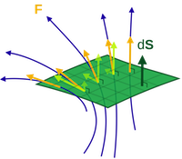
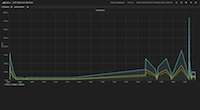
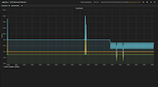
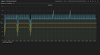
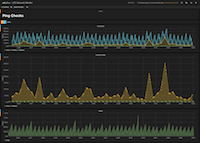

# pflux [](https://travis-ci.org/lfe/pflux)



**A simple host-monitoring tool written in LFE**


## Introduction

pflux is built with [LFE](https://github.com/rvirding/lfe),
[InfluxDB](http://influxdb.com/download/),
[Grafana](http://grafana.org/), and [YAWS](http://yaws.hyber.org/).

As for the name, Clojure nabbed the obvious choice for an InfluxDB
client: [Capacitor](https://github.com/olauzon/capacitor).
Naturally, quantum mechanics was the next thought, which lead to the
inexorable "probability flux" (easier to type "pflux"), a term which denotes
the probability per unit time per unit area.

There you have it.


### Dependencies

This project assumes that you have [rebar](https://github.com/rebar/rebar)
and [lfetool](https://github.com/lfe/lfetool) installed somwhere in your
``$PATH``.

pflux installs LFE/Erlang dependencies automatically when you compile.
Non-LFE/Erlang dependencies have separate instructions below.


### Screenshots

Here are some views of some ping results (3 network classifications, 8
hosts):

<a href="resources/images/Screenshot-2014-05-26-16.58.31.png"></a>

<a href="resources/images/Screenshot-2014-05-26-16.59.04.png"></a>

<a href="resources/images/Screenshot-2014-05-26-16.59.42.png"></a>

<a href="resources/images/Screenshot-2014-05-26-23.03.59.png"></a>


## Configuration

### ElasticSearch

* Send a ``PUT`` to [http://localhost:9200/ping-stats](http://localhost:9200/ping-stats)

* Send a ``PUT`` to [http://localhost:9200/ping-stats/ping-stat/_mapping](http://localhost:9200/ping-stats/ping-stat/_mapping)
  with the following data in the body:

```json

    {"ping-stat": {
       "properties": {
         "ip": {"type": "string"},
         "network": {"type": "string"},
         "latency": {"type": "float"}
         }}}
```


### InfluxDB

* Download and install [InfluxDB](http://influxdb.com/download/), following
  the
  [instructions](http://influxdb.com/docs/v0.7/introduction/installation.html).

* Load [http://localhost:8083/](http://localhost:8083/) in your browser,
  connect using the default username and password (root/root) on port 8086.

* In the field under "Create Database" type "ping-stats" and then click
  "Create".


### pflux

If you have changed the InfluxDB username or password, you'll need to update
your pflux configuration data in the ``env`` section of the
``src/pflux.app.src`` file.

Once you've got your config all set, build pflux:

* ``make compile``

You'll need to set up your servers as well. You can do this easily by
starting up the LFE REPL:

```bash
    $ make shell-no-deps
```

Once there, you can create servers like so:

```cl
    > (pflux-app:load)
    ok
    > (pflux:store-server "google-dns" "8.8.8.8" "external" "google")
    ok
    > (pflux:store-server "router" "192.168.1.1" "wired" "internal")
    ok
    > (pflux:store-server "wifi-ap" "192.168.1.1" "wireless" "internal")
    ok
```

The parameters passed to ``store-server`` map, in order, to the following
columns in InfluxDB:
 * ``name``
 * ``ip``
 * ``group``
 * ``network``

Admittedly the last two are named poorly (and evolved over the course of learning Grafana). 
The intent behind these was to provide several means of portraying different levels
of granularity for server response times.You may, of course, use them however you wish :-)

With the servers created, let's do a quick sanity check:

```cl

    > (pflux:get-ips)
    ("192.168.1.1" "192.168.1.1" "8.8.8.8")
```

Once your servers are set up, you're ready to start the app. See the "Usage" section
below for instructions.

### YAWS

You shouldn't need to change anything here. Just start it up in a separate
terminal window with ``make dev``.


### Grafana

* Open [http://localhost:8080/dashboard/](http://localhost:8080/dashboard/)
  in your browser.

* Get a quick start by copying
  <a href="https://gist.github.com/anonymous/0114d215a91ddfd7f76f">this
  URL</a> and pasting it in the Github gist URL when you click on the folder
  ("search") icon and then the "Import" link.


## Usage

pflux is really used through the browser. In particular, the Grafana JS application
is responsible for presenting the data collected by the LFE OTP application.

The docs for Grafana + InfluxDB aren't the best, but we were able to poke arlound
for a while and get to know it without them. Some things aren't terribly intuitive
(e.g., you need to single quote entires in the graph filters), but once you get
used to it, things start to click and the absense of docs doesn't seem so bad.


### Running

#### From the REPL

```bash
    $ make shell-no-deps
```

Then:

```cl
    > (pflux-app:start)
    #(ok <0.62.0>)
```

Once started, the application will immediately begin pinging the servers
you added. If you load up your local InfluxDB in a browser, you can
execute the following query to see that the monitoring data is indeed
showing up:

```sql

    select * from ping-times
```

Quitting the shell will stop the application, since it was started via
a manual command in the REPL. See the section "From the Command Line" for
instructions on running in debug mode or as a daemon.


#### From the Command Line

TBD

(There's a make target for this, but the pinger currently only executes once. See
ticket lfe/pflux/#10 for more info/current status.)
